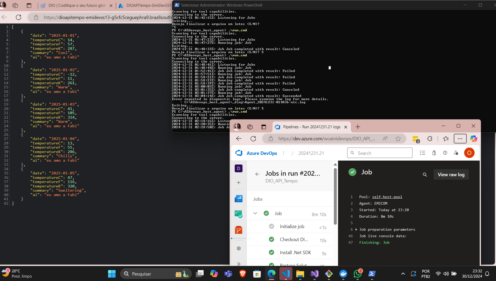

# WebApp+Devops Pipeline Dio AZ204 

Implementar o pipeline DevOps foi um desafio tranquilo, apesar de precisar ir atrás de conhecimentos específicos como os self-hosted agents do devops para que fosse possível rodar o pipeline.

# Output

O retorno da aplicação em questão é um JSON do clima, e uma mensagem de amor (vide imagem acima)!